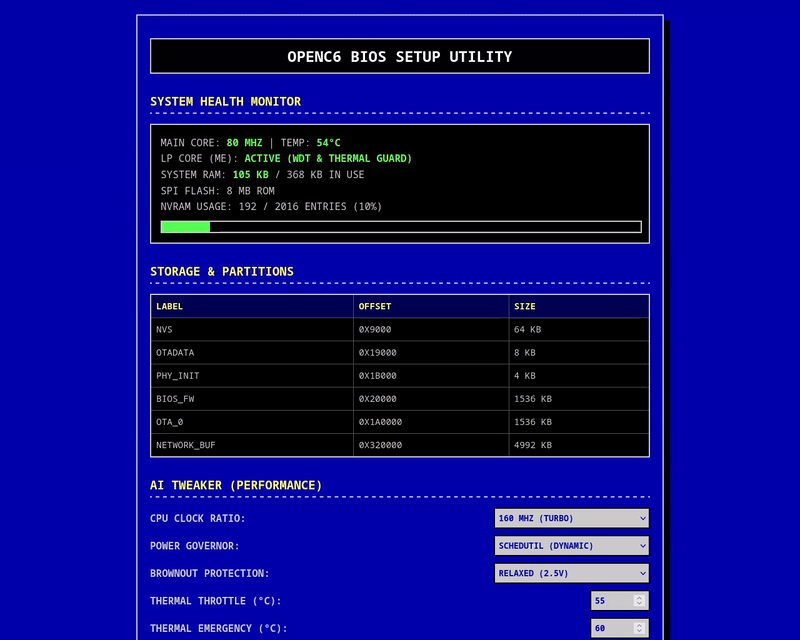

# OpenC6 BIOS: Advanced Modular Firmware for ESP32-C6

[](https://opensource.org/licenses/MIT)
[](https://www.espressif.com/en/products/socs/esp32-c6)
[](https://riscv.org/)

<p align="center">
  <a href="https://trendshift.io/repositories/54987?utm_source=trendshift-badge&utm_medium=badge&utm_campaign=badge-trendshift-54987" target="_blank" rel="noopener noreferrer">
    
  </a>
</p>

OpenC6 BIOS is an open-source, high-performance modular platform (BIOS) for the ESP32-C6 (RISC-V) microcontroller. It decouples hardware initialization from application logic, bringing a PC/Server-like architecture to microcontrollers.

Instead of monolithic firmwares, OpenC6 acts as a host platform. It initializes the hardware, provides out-of-band management via an independent LP-Core coprocessor, and exposes a standardized System Call Interface (ABI). This allows you to hot-swap, download, and execute bare-metal Payloads directly into RAM or Execute-In-Place (XIP) Flash.

---

## Visual Demos

### 1. Retro Web Setup Utility (1280x1024 5:4 Native Look)
Nostalgic classic PC BIOS running on ESP32-C6 via local Wi-Fi.


### 2. Micro UNIX Shell (Interactive File System Explorer)
Inspect, read, write, and execute files directly on the custom log-structured flash file system via the serial terminal.


### 3. Wireless BIOS Firmware Update (OTA)
Safe wireless BIOS flashing over Wi-Fi with hardware A/B partition rollback protection.


### 4. Aura Sync RGB Flow (Dynamic Hardware Diagnostics)
Real-time addressable POST LED smoothly cycling colors (Aura Sync) and flashing post codes during hardware initialization.


---

## Key Architectural Features

* **LP-Core Management Engine (ME):** An autonomous out-of-band RISC-V coprocessor that monitors system health, reads the power button, handles hardware Watchdogs, and triggers emergency thermal shutdowns even if the main OS crashes.
* **SchedUtil Dynamic Governor:** Real-time load-adaptive CPU frequency scaling (80/120/160 MHz) calculated via FreeRTOS idle cycles.
* **Network Boot (PXE):** Dynamically fetch and execute bare-metal payloads over Wi-Fi without wearing out the flash memory using physical USB tools.
* **Anti-Brick A/B OTA:** Network updates for the BIOS itself are protected by hardware rollback mechanisms.
* **Retro Web Setup Utility:** An integrated AP-mode web server with a classic blue-screen BIOS interface for AI Tweaker configurations (Overclocking, BOD levels, Thermal limits).
* **Standardized ABI:** Payloads compile without ESP-IDF (-nostdlib -fPIC), weighing only 2-10 KB, while utilizing BIOS-provided Wi-Fi, Math, and Crypto engines.
* **Log-Structured Circular File System (openc6_fs):** A custom chunk-based file system with dynamic wear leveling and dynamic RAM indexing that supports files larger than a single sector.

---

## Comprehensive Documentation

The architecture of OpenC6 is heavily documented. Please refer to the docs/ directory for deep technical dives into each subsystem:

1. [bios_core.md](docs/bios_core.md) - State machine, Boot Dispatcher & System ABI.
2. [main_entry_point.md](docs/main_entry_point.md) - Host initialization vector and application entry.
3. [management_engine.md](docs/management_engine.md) - LP-Core IPC, Watchdogs, and Power Button logic.
4. [power_management.md](docs/power_management.md) - AI Tweaker, Brownout Detector (BOD), and SchedUtil.
5. [boot_manager.md](docs/boot_manager.md) - Interactive Boot Menu and Serial Protocol.
6. [pxe_network_boot.md](docs/pxe_network_boot.md) - Network Boot and OTA specifications.
7. [nvram.md](docs/nvram.md) - Virtual CMOS database schema and Clear CMOS routines.
8. [led_management.md](docs/led_management.md) - Aura Sync RGB and POST Diagnostics.
9. [bios_setup_web_ui.md](docs/bios_setup_web_ui.md) - REST API and Retro Web Configurator.
10. [wifi_management.md](docs/wifi_management.md) - Network stack and safe netif re-use.
11. [openc6_fs.md](docs/openc6_fs.md) - Log-structured circular file system layout, dynamic wear leveling, and chunk-based allocation.
12. [payload_development_serial_boot.md](docs/payload_development_serial_boot.md) - How to compile payloads and use the UART Loader.

---

## Hardware Pinout (ESP32-C6-Zero / Generic C6)

| Component          | GPIO Pin                            | Description                                                        |
| :----------------- | :---------------------------------: | :----------------------------------------------------------------- |
| **Power Button**   | `GPIO 4` (Sense) & `GPIO 3` (GND)   | Short click: Boot. Hold 3s: Setup. Hold 5s: Hard Reset.            |
| **BOOT Button**    | `GPIO 9`                            | Standard ESP32 BOOT pin. Hold during startup for Boot Menu.        |
| **POST LED**       | `GPIO 8`                            | Addressable RGB (GBR layout). Used for Aura Sync and diagnostics.  |
| **Clear CMOS**     | `GPIO 2` (Sense) & `GPIO 1` (GND)   | Short these pins during boot to reset NVRAM to factory defaults.   |
| **Payload RX**     | `GPIO 19` (Connect to CP2102 TX)    | Dedicated UART RX for Serial Bootloader.                           |
| **Payload TX**     | `GPIO 18` (Connect to CP2102 RX)    | Dedicated UART TX for Serial Bootloader.                           |

---

## Quick Start Guide

### 1. Build and Flash the BIOS
Ensure you have the ESP-IDF (v6.1-dev) installed and sourced.
```bash
. $IDF_PATH/export.sh
idf.py build flash monitor -p /dev/ttyACM0
```

### 2. Build the Bare-Metal Payload
Navigate to the tools/ directory to compile the C++ host loader and the RISC-V payload.
```bash
cd tools/
mkdir build && cd build
cmake ..
make
```
See [payload_development_serial_boot.md](docs/payload_development_serial_boot.md) for instructions on deploying via the UART Serial Loader.

---

## Network Booting & OTA Updates

OpenC6 allows you to download Payloads or update the BIOS entirely over your home Wi-Fi using a simple local Python web server.

### Method A: Network Booting a Payload (PXE)
This method downloads payload.bin into Flash (XIP) and boots it.

1. Open a terminal on your PC, navigate to the tools/ directory (where your compiled payload.bin is located), and start a local HTTP server:
   ```bash
   python3 -m http.server 8080
   ```
2. Power on the ESP32-C6 and enter BIOS Setup (Hold Power Button for 3s OR hold BOOT to enter the menu and select the 5th option).
3. Connect your phone/PC to the BIOS_SETUP_C6 Wi-Fi network (Password: 12345678) and open http://192.168.4.1.
4. Enter your home Wi-Fi SSID and Password.
5. Set the PXE Server URL to your PC's local IP:
   ```text
   http://<YOUR_PC_LOCAL_IP>:8080/payload.bin
   ```
6. Click [ F10: Save & Exit ].
7. While the board reboots, hold the BOOT (GPIO 9) button to open the Interactive Menu.
8. Select [0] Network Boot (PXE) (1 blink). The BIOS will connect to your router, download the payload, and execute it.

### Method B: Wireless BIOS Firmware Update (OTA)
This method safely reflashes the core openc6_bios.bin (the host system) using hardware A/B partition rollback protection.

1. Compile your new BIOS using `idf.py build`.
2. Navigate to the ESP-IDF build/ directory in the root of the project.
3. Start the Python server there:
   ```bash
   python3 -m http.server 8080
   ```
4. Enter the BIOS Setup Web UI (192.168.4.1) as described above. Ensure Wi-Fi credentials are correct.
5. Change the PXE Server URL to point to the newly compiled BIOS binary:
   ```text
   http://<YOUR_PC_LOCAL_IP>:8080/openc6_bios.bin
   ```
   *(Note: Replace openc6_bios.bin with your actual project binary name)*.
6. Click [ F10: Save & Exit ].
7. Wait for the board to reboot, then enter the BIOS Setup Web UI again.
8. Click the [ F12: Network BIOS Update ] button.
9. The system will restart, connect to your router, download the new BIOS into the passive OTA slot, and reboot.

Anti-Brick Safety: If the new BIOS crashes, the LP-Core Watchdog will trigger a hardware reset, and the ESP32 bootloader will automatically roll back to the previous stable version!

---

## Roadmap & Known Issues (Help Wanted!)

This project is actively evolving. Pull requests and community contributions are highly welcome for the following milestones:

* **ESP32-P4 Porting (Active Focus):** We are actively porting the OpenC6 BIOS platform to the high-performance ESP32-P4 (dual-core RISC-V, parallel display support, MIPI-DSI). We welcome the community to contribute to this port, especially in writing the parallel display driver, setting up the hardware layouts, and adapting the retro setup GUI.
* **~~Custom Open-Source File System~~:** ~~Designing a lightweight, entirely new file system from scratch, exposing storage read/write capabilities directly to payloads via the BIOS ABI structure.~~ (Completed with `openc6_fs` chunked allocation support)
* **Custom zRAM Implementation:** Developing a brand-new, custom high-speed compression algorithm specifically tailored for the RISC-V architecture to expand SRAM execution memory for complex payloads.
* **Security Validation:** Adding SHA256 checksum verification to PXE and Serial Boot payload transfers to prevent corrupted executions.
* **Watchdog Delegation:** Exposing the pet_watchdog() function to the ABI so payloads can be monitored for thread-locks.

---

## License

This project is licensed under the MIT License. See the LICENSE file for details. Let's change the embedded development paradigm together!
